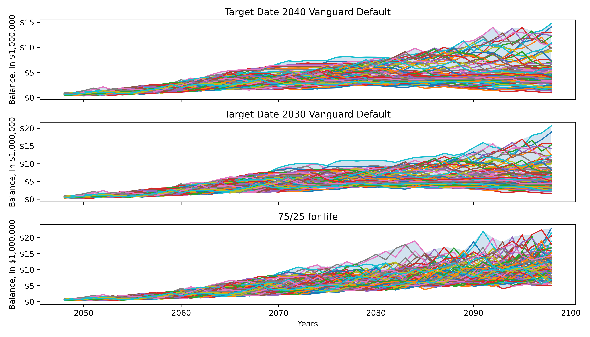
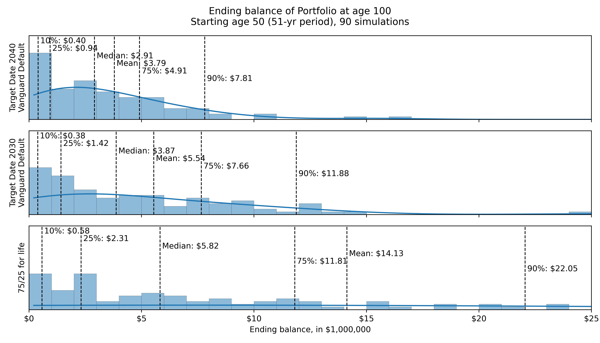

# Simulating Various Asset Allocation Strategies

## About

Monte Carlo and Historical simulations of various asset allocation strategies in retirement funds. Factors in federal and NYS tax.

## Examples and Results

Some plots showcasing example asset allocation strategies for historical simulations and monte carlo simulations:

| Time Series Plot (Historical Simulations) |
|:-:|
|  |

| Histogram of Ending Balance (Monte Carlo Simulations) |
|:-:|
|  |

Explore more examples within the `./examples/` directory.

## Requirements

Libraries required:

* `matplotlib`
* `numpy`
* `pandas`
* `jupyter`

## Usage

1. Clone this repo
```git clone https://github.com/petertadrous/monte-carlo-simulations.git```
2. Install the required packages
```pip install -U -r requirements.txt```
3. Open jupyter notebook
```jupyter notebook```
4. Modify the parameters in the notebook to create a `Retiree()` object, as well as objects for `Four01k()` and `IRA()`. Create the static dataframe of contributions using `make_retiree_df()` method.
5. Use the imported methods to create a parameterized allocation strategy, or define a custom strategy (2d numpy array).
6. Run either historical or monte carlo simulations, and visualize strategies to compare.

## License

MIT License
Copyright (c) 2024 petertadrous

## Contact

Peter Tadrous - <petertadrous@gmail.com>
Project Link: <https://github.com/petertadrous/monte-carlo-simulations>
